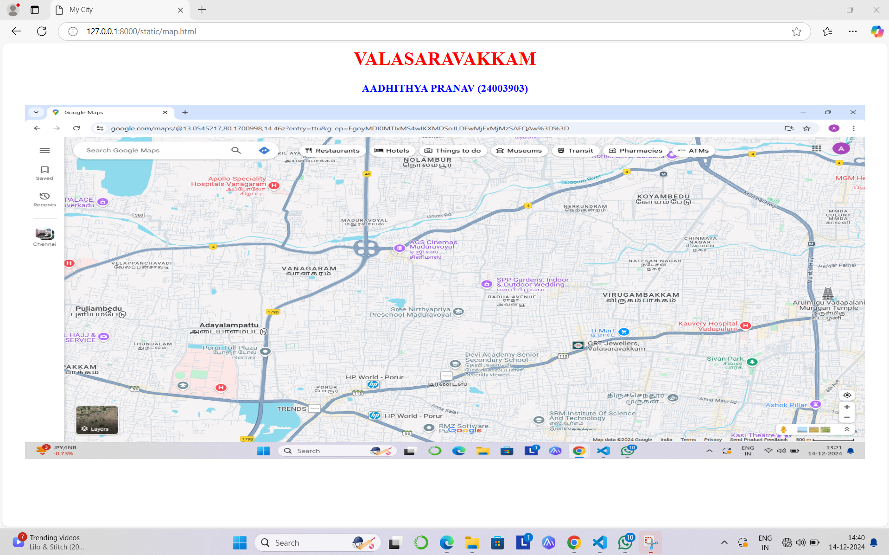
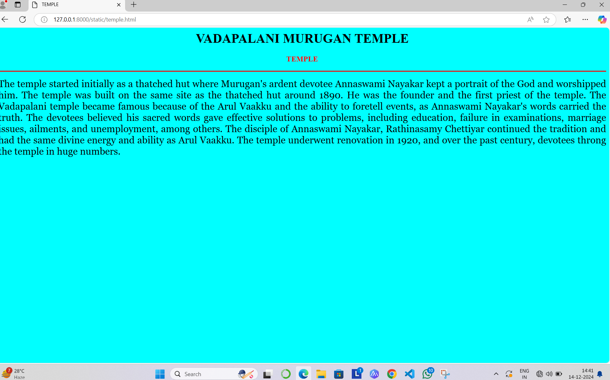
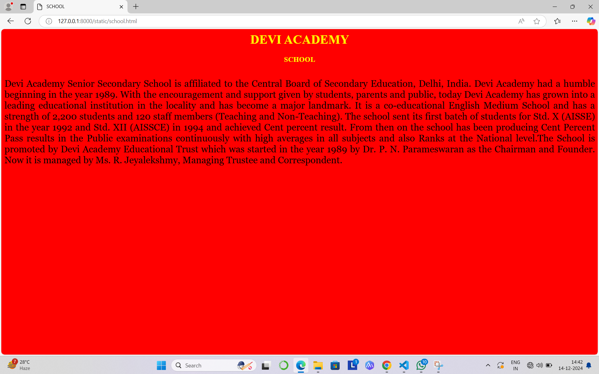
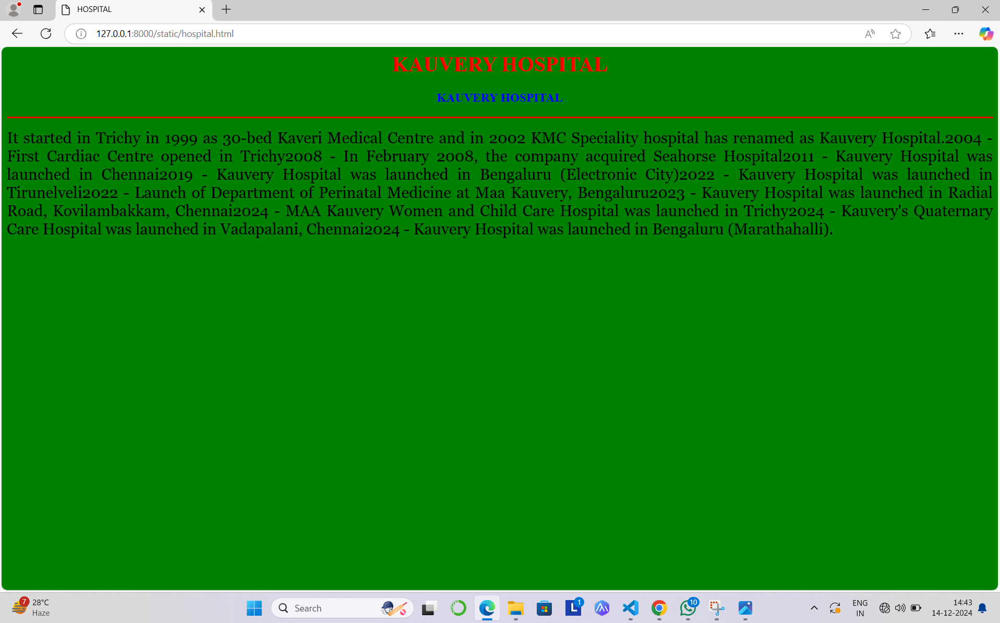
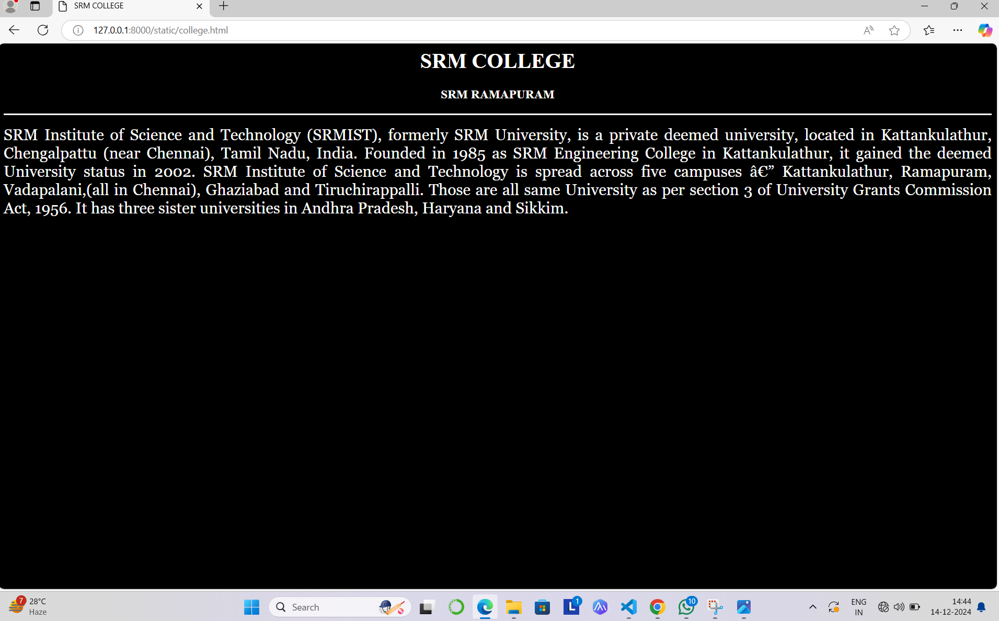
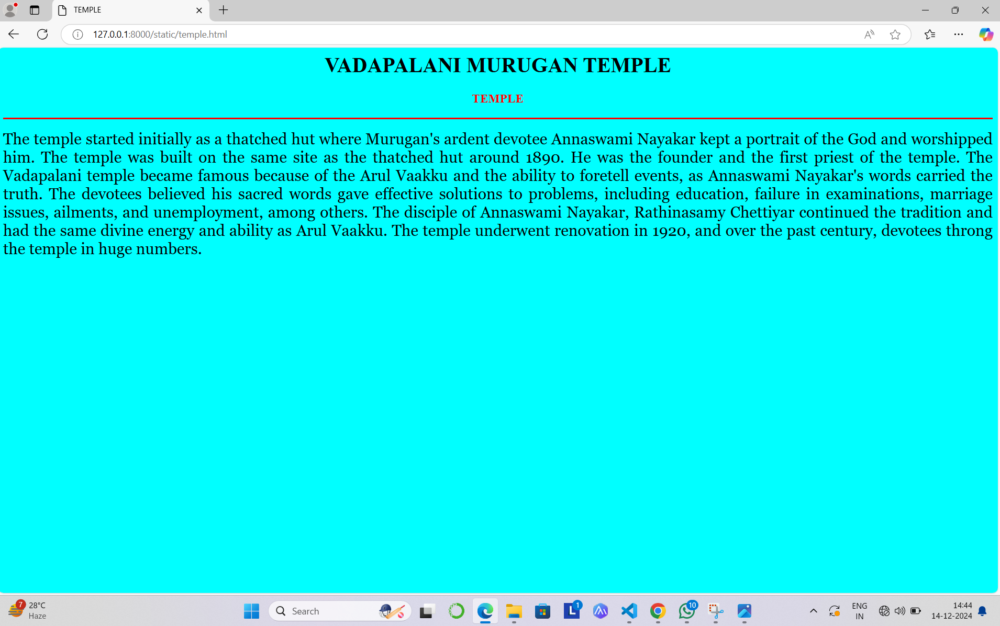

# Ex04 Places Around Me
## Date: 14.12.24

## AIM
To develop a website to display details about the places around my house.

## DESIGN STEPS

### STEP 1
Create a Django admin interface.

### STEP 2
Download your city map from Google.

### STEP 3
Using ```<map>``` tag name the map.

### STEP 4
Create clickable regions in the image using ```<area>``` tag.

### STEP 5
Write HTML programs for all the regions identified.

### STEP 6
Execute the programs and publish them.

## CODE
```
map.html
<html>
<head>
<title>My City</title>
</head>
<body>
<h1 align="center">
<font color="red"><b>VALASARAVAKKAM</b></font>
</h1>
<h3 align="center">
<font color="blue"><b>AADHITHYA PRANAV (24003903)</b></font>
</h3>
<center>

<map name="MyCity">
<area shape="rect" coords="700, 250, 850,400" href="home.html" title="MY HOME TOWN">
<area shape="circle" coords="570,230,45" href="temple.html" title="VADAPALANI MURUGAN TEMPLE">
<area shape="rect" coords="500,100,600,400" href="college.html" title="SRM RAMAPURAM">
<area shape="rect" coords="600, 200, 700,500" href="school.html" title="DEVI ACADEMY">
<area shape="rect" coords="950, 120, 1100, 140" href="hospital.html" title="CAUVERY HOSPITAL">
</map>
</center>
</body>
</html>

home.html
<html>
<head>
<title>My Home Town</title>
</head>
<body bgcolor="yellow">
<h1 align="center">
<font color="red"><b>VALASARAVAKKAM</b></font>
</h1>
<h3 align="center">
<font color="blue"><b>THE TOWN</b></font>
</h3>
<hr size="3" color="red">
<p align="justify">
<font face="Georgia" size="5">
Valasaravakkam is a neighbourhood in the Chennai district of the Indian state of Tamil Nadu and a residential suburb of the city of Chennai. It is located in the Maduravoyal Taluk at a distance of approximately 15 kilometres from the Kilometer Zero stone. Valasaravakkam lies on the Arcot Road, one of Chennai's arterial roads. It is under the Maduravoyal election constituency. In October, 2011 Valasaravakkam Municipality ceased to exist and the area became part of Chennai Corporation as Ward Nos 149 and 152 (Zone XI), Southern Region, Corporation of Chennai. As of 2011, the town had a population of 47,378. Famous Sivan temple is in Kesavardhini.
</p>
</body>
</html>

hospital.html
<html>
<head>
<title>HOSPITAL</title>
</head>
<body bgcolor="green">
<h1 align="center">
<font color="red"><b>KAUVERY HOSPITAL</b></font>
</h1>
<h3 align="center">
<font color="blue"><b>KAUVERY HOSPITAL </b></font>
</h3>
<hr size="3" color="red">
<p align="justify">
<font face="Georgia" size="5">
It started in Trichy in 1999 as 30-bed Kaveri Medical Centre and in 2002 KMC Speciality hospital has renamed as Kauvery Hospital.2004 - First Cardiac Centre opened in Trichy2008 - In February 2008, the company acquired Seahorse Hospital2011 - Kauvery Hospital was launched in Chennai2019 - Kauvery Hospital was launched in Bengaluru (Electronic City)2022 - Kauvery Hospital was launched in Tirunelveli2022 - Launch of Department of Perinatal Medicine at Maa Kauvery, Bengaluru2023 - Kauvery Hospital was launched in Radial Road, Kovilambakkam, Chennai2024 - MAA Kauvery Women and Child Care Hospital was launched in Trichy2024 - Kauvery's Quaternary Care Hospital was launched in Vadapalani, Chennai2024 - Kauvery Hospital was launched in Bengaluru (Marathahalli).
</p>
</body>
</html>

school.html

<html>
<head>
<title>SCHOOL</title>
</head>
<body bgcolor="red">
<h1 align="center">
<font color="yellow"><b>DEVI ACADEMY</b></font>
</h1>
<h3 align="center">
<font color="yellow"><b>SCHOOL</b></font>
</h3>
<hr size="3" color="red">
<p align="justify">
<font face="Georgia" size="5">
Devi Academy Senior Secondary School is affiliated to the Central Board of Secondary Education, Delhi, India. Devi Academy had a humble beginning in the year 1989. With the encouragement and support given by students, parents and public, today Devi Academy has grown into a leading educational institution in the locality and has become a major landmark. It is a co-educational English Medium School and has a strength of 2,200 students and 120 staff members (Teaching and Non-Teaching). The school sent its first batch of students for Std. X (AISSE) in the year 1992 and Std. XII (AISSCE) in 1994 and achieved Cent percent result. From then on the school has been producing Cent Percent Pass results in the Public examinations continuously with high averages in all subjects and also Ranks at the National level.The School is promoted by Devi Academy Educational Trust which was started in the year 1989 by Dr. P. N. Parameswaran as the Chairman and Founder. Now it is managed by Ms. R. Jeyalekshmy, Managing Trustee and Correspondent.</p>
</body>
</html>

temple.html

<html>
<head>
<title>TEMPLE</title>
</head>
<body bgcolor="cyan">
<h1 align="center">
<font color="BLACK"><b>VADAPALANI MURUGAN TEMPLE</b></font>
</h1>
<h3 align="center">
<font color="red"><b>TEMPLE</b></font>
</h3>
<hr size="3" color="red">
<p align="justify">
<font face="Georgia" size="5">
The temple started initially as a thatched hut where Murugan's ardent devotee Annaswami Nayakar kept a portrait of the God and worshipped him. The temple was built on the same site as the thatched hut around 1890. He was the founder and the first priest of the temple. The Vadapalani temple became famous because of the Arul Vaakku and the ability to foretell events, as Annaswami Nayakar's words carried the truth. The devotees believed his sacred words gave effective solutions to problems, including education, failure in examinations, marriage issues, ailments, and unemployment, among others. The disciple of Annaswami Nayakar, Rathinasamy Chettiyar continued the tradition and had the same divine energy and ability as Arul Vaakku. The temple underwent renovation in 1920, and over the past century, devotees throng the temple in huge numbers.
</p>
</body>
</html>

college.html

<html>
<head>
<title>SRM COLLEGE</title>
</head>
<body bgcolor="black">
<h1 align="center">
<font color="white"><b>SRM COLLEGE</b></font>
</h1>
<h3 align="center">
<font color="white"><b>SRM RAMAPURAM</b></font>
</h3>
<hr size="3" color="white">
<p align="justify">
<font face="Georgia" size="5" color="white">
SRM Institute of Science and Technology (SRMIST), formerly SRM University, is a private deemed university, located in Kattankulathur, Chengalpattu (near Chennai), Tamil Nadu, India. Founded in 1985 as SRM Engineering College in Kattankulathur, it gained the deemed University status in 2002. SRM Institute of Science and Technology is spread across five campuses — Kattankulathur, Ramapuram, Vadapalani,(all in Chennai), Ghaziabad and Tiruchirappalli. Those are all same University as per section 3 of University Grants Commission Act, 1956. It has three sister universities in Andhra Pradesh, Haryana and Sikkim.</p>
</body>
</html>
```


## OUTPUT








## RESULT
The program for implementing image maps using HTML is executed successfully.
